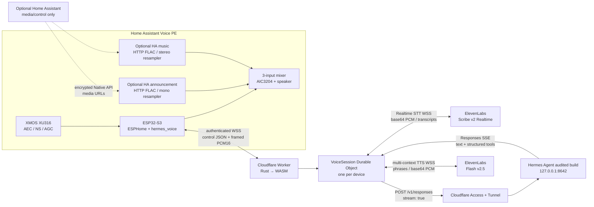
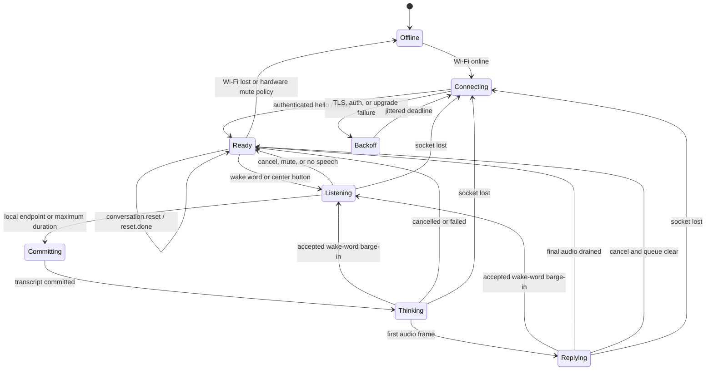

# Architecture

## System context

Realtime v2 is the primary path:



Home Assistant is absent from this transport. Hermes can still use a Home Assistant tool if the operator explicitly configures one, but Voice PE capture, conversation transport, and playback do not depend on Home Assistant.

Home Assistant may still connect locally through the encrypted ESPHome Native API to expose one media-player entity with independent announcement and music pipelines. The three mixer inputs are Hermes TTS, HA HTTP/FLAC announcements, and HA HTTP/FLAC music. Starting a Hermes turn immediately ducks both HA inputs by 20 dB so neither competes with capture or the reply. Returning to idle restores the announcement path quickly and music over approximately one second unless an HA announcement is still active, in which case its normal media duck remains in force. This is a parallel convenience plane: Home Assistant outage or removal stops HA media control but does not affect wake, STT, Hermes, TTS, or the device/gateway WebSocket.

## ESPHome provisioning and management plane

ESPHome compatibility is retained as a current release boundary. A universal zero-secret factory image advertises physically authorized Improv BLE and Improv Serial, a MAC-suffixed node name, Native API/mDNS project information, and a public Dashboard Import package. Home Assistant may reach Improv directly, through a phone, or through an existing active ESPHome Bluetooth proxy; Voice PE is not itself a Bluetooth proxy.

After Wi-Fi provisioning, Home Assistant/ESPHome Device Builder owns the normal encrypted API, logs, native OTA, safe mode and adopted YAML. The first imported image is allowed to have no gateway URL/token: Hermes allocates no transport/audio state while API, OTA, HA media and provisioning remain usable. The immediate hardening/enrollment OTA adds the credential-free Worker URL, that unit's bearer, and a random OTA password. The default Worker identity derives from hardware MAC and is independent of node renames. BLE is disabled before realtime audio and restored on Wi-Fi loss. See [`esphome-adoption.md`](esphome-adoption.md).

The disabled-by-default diagnostic compatibility route is:

```text
POST /v1/voice with complete WAV
  → batch STT
  → non-streaming Hermes response
  → streaming HTTP TTS PCM response
```

When `DIAGNOSTIC_V1_ENABLED=true`, it shares provider credentials but sends a non-streaming Hermes request with `store: false`, no previous response, and a hashed diagnostic memory scope. It neither creates a response chain nor reads/advances realtime conversation state. Disabled v1 is indistinguishable from an unknown route.

## Responsibility split

| Component | Owns | Does not own |
| --- | --- | --- |
| Voice PE | Wake word, capture, local endpoint hint, sequence numbers, bounded transmit/credit windows, speaker queue, physical controls, reset request ID, LED state. | Provider credentials, conversation history, tool policy. |
| Optional Home Assistant | Encrypted LAN media-player control and media URL serving. | Voice capture, STT, Hermes conversation state, provider credentials. |
| Edge Worker | Route validation, bearer authentication, per-device Durable Object selection, buffered v1 routing. | Voice session state. |
| Per-device Durable Object | Ordered realtime session, turn state, flow control, upstream sockets, Hermes SSE parser, phrase segmentation, cancellation, conversation UUID, Hermes binding fence, completed response head, returned Hermes session ID, activity/reset metadata, and turn journal. | Permanent transcript/audio archive. |
| ElevenLabs Scribe | Realtime partial and committed transcription. | Agent/tool decisions. |
| Hermes | Conversation reconstruction, model reasoning, tools, memory, final response semantics. | Remote audio transport. |
| ElevenLabs TTS | Incremental PCM generation and cancellable synthesis contexts. | Device playback queue. |

The Durable Object stores only the minimum continuity metadata. Audio, transcripts, Hermes deltas, tool payloads, and TTS bytes are transient. Its versioned record contains an opaque conversation UUID; a SHA-256 fingerprint over the bound Hermes base URL, model/route label, profile ID, binding revision, and resolved session key (not those raw values); the last completed Hermes response ID; the `X-Hermes-Session-Id` returned with that response; last accepted-turn/completion activity time; and the last accepted reset request ID. A small current-turn journal records the conversation UUID, prior head, deterministic idempotency key, in-flight response candidate, and recovery state. A separate bounded record accounts per-device messages, turn attempts, and audio in a 24-hour window. This survives device reconnects, ESP32 reboots, Worker deployment, and object hibernation without treating transport events as user conversation boundaries.

## Device audio paths

Idle and active capture use the Voice PE hardware normally:

```text
Idle:
  XMOS channel 1 → PCM16, gain ×4 → micro_wake_word

Voice turn:
  stop micro_wake_word and wait for microphone ownership release
  XMOS channel 0 → PCM16/16 kHz → small bounded frame queue → WSS

Reply:
  WSS PCM16/16 kHz → bounded playback queue
    → resampler 48 kHz
    → Hermes stereo mixer input
    → I²S 32-bit/48 kHz
    → AIC3204 / speaker

Optional Home Assistant audio:
  encrypted Native API command
    → HTTP FLAC announcement → 48 kHz mono resampler → announcement mixer input
    → HTTP FLAC music → 48 kHz stereo resampler → music mixer input
    → I²S / AIC3204 / speaker

During a Hermes turn:
  music mixer input immediately ducked by 20 dB; Hermes input remains foreground
  idle restores music over ~1 s unless an HA announcement still requires ducking
```

Waiting until `micro_wake_word` reports stopped is mandatory for an ordinary turn because both sources share the underlying ESPHome microphone. Playback stays on the standard I²S path so XMOS receives its acoustic echo reference. During a reply, wake-word inference shares the live I²S source with the committed channel-0 stream; after wake detection, firmware clears/stops old playback before capturing the new command. That overlap is subject to physical AEC validation.

Realtime v2 streams as soon as `turn.ready` arrives and never waits to assemble an utterance before upload. Its external-PSRAM input ring is nevertheless bounded at 1 MiB, enough to retain the configured 30-second maximum capture through the gateway's worst-case recovery/cold-STT readiness budget without losing the beginning; the independent network in-flight window remains 32 × 2,048-byte frames (64 KiB). The output ring is 128 KiB. An operator-selected v1 diagnostic client must instead assemble a complete WAV before making its request; the current realtime firmware does not switch transports automatically.

## Device connection state



On reconnect, transport sequence state is new. A partially transmitted turn before Hermes starts is safely discarded. A turn interrupted after Hermes may have accepted it is never replayed automatically; if reconciliation cannot prove completion, the Durable Object preserves the safe head but blocks later turns as `conversation_ambiguous` until the user explicitly resets. Reconnect, reboot, wake, cancellation, and barge-in are transport/turn events, not implicit conversation boundaries.

## Realtime turn pipeline

1. The device authenticates the persistent `/v2/realtime` WebSocket and receives negotiated queue/window limits.
2. Wake word or a short center-button press creates a unique turn ID. Capture starts into the bounded input ring and the device sends `turn.start`.
3. The Durable Object opens Scribe Realtime and sends `turn.ready` after `session_started`. The device then streams queued and newly captured binary PCM frames while speech continues. The Durable Object validates the 20-byte header, current turn, monotonic sequence/sample offset, and bounds, acknowledges accepted 64 ms frames, and coalesces adjacent pairs into approximately 128 ms Scribe messages. A lone remaining frame is attached to the final upstream message with `commit: true`.
4. Scribe may emit mutable `partial_transcript` events. The shipped gateway discards them. Neither partial nor final transcript text is sent back to the headless device; only the committed transcript is transiently forwarded to Hermes.
5. On local endpoint, the device sends the turn-end control. The Durable Object sends Scribe's manual commit, attaching a lone frame still held by the two-frame coalescer or using an empty audio field when none remains, and waits for one non-empty `committed_transcript`.
6. The Durable Object journals a deterministic conversation/turn idempotency key, then starts Hermes `POST /v1/responses` with `stream: true`, `store: true`, the stable long-term-memory session key, and the last completed `previous_response_id` when one exists. The endpoint and API key select the Hermes profile; the request `model` value is cosmetic. `response.start` is sent to the device only after the authenticated Hermes origin returns exact HTTP `200` with a case-insensitive `text/event-stream` media type; other `2xx`, redirects, missing/wrong media types, and provider errors fail closed.
7. Structured function-call items are status only. Only `response.output_text.delta` contributes speakable text.
8. The phrase assembler turns append-only deltas into natural chunks. A small stateful sanitizer carries fenced-code and partial-backtick state across phrase boundaries, then applies the ordinary same-phrase Markdown-link, markup, and bare-URL cleanup. Complete visible phrases are sent to an ElevenLabs multi-context TTS context for that turn; structured tool payloads are excluded independently.
9. Each ElevenLabs audio message is base64-decoded, charged against the configured aggregate 1–30 second decoded-PCM limit, reframed, and immediately emitted as binary downlink PCM. The device acknowledges consumption so the gateway cannot build an unbounded playback backlog.
10. Hermes `response.completed` promotes the safe head and flushes the TTS context. After ElevenLabs marks TTS final and final PCM has left the device receive ring and is cumulatively acknowledged, the gateway emits `turn.done`; the device remains in reply state until the downstream speaker path drains, then returns to wake-ready.
11. Scribe and TTS outbound sockets close when no active turn needs them, allowing the Durable Object to hibernate with the incoming device socket still attached.

No stage waits for a complete utterance file, complete Hermes answer, or complete synthesized response. Waiting for a committed transcript is a semantic boundary, not batch buffering.

## Hermes conversation semantics

Hermes' official [API server documentation](https://hermes-agent.nousresearch.com/docs/user-guide/features/api-server/) defines Responses chaining as server-side conversation state: `previous_response_id` reconstructs the full conversation, including prior tool calls and results, and chained turns share one Hermes session. Realtime v2 uses that contract directly; it is not generic one-shot agent access.

There are four deliberately separate identifiers:

| Identifier | Lifetime and purpose |
| --- | --- |
| Device ID | Stable hardware/authentication and Durable Object routing key. |
| Durable Object conversation UUID | One explicit short-term conversation incarnation. Rotates on accepted reset, 900-second default idle expiry, an exact confirmed missing-previous-response error, or a Hermes binding change. |
| Hermes `previous_response_id` | Safe completed head inside that conversation. It causes Hermes to reconstruct the full transcript/tool history for the next reply. |
| `X-Hermes-Session-Key` | Operator-owned long-term-memory scope; stable across ordinary conversation UUID rotations and explicitly mapped by `HERMES_SESSION_KEYS_JSON`. Implicit `voice:<device-id>` requires an opt-in compatibility flag. |

The `X-Hermes-Session-Id` returned in Hermes response headers is also persisted next to the completed head as transcript-session correlation metadata. The next Responses request is continued by `previous_response_id`; the gateway does not substitute the long-term-memory key or response-header session ID for that chain.

The actual Hermes agent/profile is selected by `HERMES_BASE_URL` and `HERMES_API_KEY`, normally a profile-specific API server or route. `HERMES_MODEL` is an advertised model/route name accepted by the compatibility API, not a permission boundary. The Durable Object binds each conversation to the normalized base URL, model/route label, `HERMES_PROFILE_ID`, `HERMES_BINDING_REVISION`, and resolved session key. If any changes, it rotates before the next accepted turn and omits the old `previous_response_id`. Operators must bump the revision when behavior-defining profile configuration or voice instructions change without changing the endpoint.

Realtime v2 deliberately omits Hermes' named `conversation` alias. Hermes rejects combining it with `previous_response_id`, and its streaming implementation persists the new `in_progress` response and advances a named mapping immediately after `response.created`; a disconnect can then leave that mapping pointing to an `incomplete` response. The Durable-Object-owned completed pointer makes the promotion rule explicit.

### Reply versus new conversation

A **reply** is the next non-empty committed Scribe transcript while the same Durable Object conversation UUID is current and no ambiguous Hermes turn blocks it. It sends the last completed response ID, if any, and therefore includes prior user turns, assistant messages, function calls, and function results. A wake phrase, short button start, reconnect, device reboot, cancellation, or barge-in does not itself create a conversation boundary; an ambiguous post-Hermes interruption instead requires explicit reset before another turn.

A **new conversation** creates a new Durable Object UUID and clears the completed response head and stored Hermes response-session metadata. Explicit, idle, and confirmed-expiry rotations leave `X-Hermes-Session-Key` unchanged; a binding-change rotation adopts the newly configured scope. It occurs only when:

1. the user explicitly invokes `hermes_voice.new_conversation` through the Home Assistant **New Hermes Conversation** button or holds the physical center button for 2–5 seconds while idle;
2. the 900-second default inactivity boundary has elapsed before the next turn; or
3. Hermes returns the exact structured missing-previous-response error naming the supplied completed head; or
4. the configured Hermes base URL, model/route label, profile ID, binding revision, or resolved long-term-memory session key differs from the persisted binding; or
5. the user resolves an ambiguous post-Hermes interruption with an explicit reset.

The gateway never tries to infer a boundary from natural-language phrases such as “new topic.” Explicit user control is authoritative. The safe shared-room default is a 15-minute inactivity boundary; disabling it requires an explicit unbounded-conversation acknowledgement.

Explicit reset is an idempotent mini-protocol. The firmware generates one fixed-width 16-hex `request_id`, sends `conversation.reset`, and retains that ID across an ambiguous reconnect/retry. The Durable Object persists the last reset request ID with the newly generated UUID before sending `conversation.reset.done`. Retrying that most-recent request returns the same UUID; a new user action creates a distinct request and conversation. Reset is accepted only while no turn or other reset is active, preventing a completed tool response and a reset from racing for the head.

`CONVERSATION_IDLE_SECONDS` defaults to `900` and accepts 60–31,536,000 seconds. Expiry is checked when a new turn is reserved, so no alarm or idle billing is required. Activity is updated atomically when a unique `turn.start` is accepted and refreshed when Hermes completes; a failed or cancelled accepted turn therefore still postpones idle expiry, and a long successful turn measures the next idle period from completion. `0`, `off`, or `none` disables the policy only when `ALLOW_UNBOUNDED_CONVERSATION=true`; omission retains 900 seconds.

The Durable Object maintains:

```text
completed_response_id   persisted safe head, optional
inflight_response_id    persisted reconciliation candidate, never used by a new turn yet
conversation_id         persisted opaque UUID for the current conversation
binding                 one-way fingerprint of Hermes origin/model/profile/revision/session scope
hermes_session_id       returned response-header metadata for the completed head
last_activity           accepted-turn/completion wall-clock time, optional
last_reset_request_id   persisted reset idempotency key, optional
turn_idempotency_key    deterministic Hermes request key in the turn journal
```

Promotion is transactional at the protocol level:

1. `response.created` supplies the current candidate ID; the Durable Object journals it as `inflight_response_id` for crash/restart reconciliation.
2. Text and tool items may follow, and Hermes may already perform side effects.
3. Only `response.completed` with embedded `response.status == "completed"` promotes the candidate to `completed_response_id`.
4. `response.failed`, malformed SSE, missing terminal event, device disconnect, local cancellation, or an aborted fetch **before** the terminal completion leaves the previous completed head unchanged.
5. After a Durable Object restart, `GET /v1/responses/{inflight_response_id}` may reconcile the journal. Only a retrieved response whose status is exactly `completed` can be promoted. A request still at `starting_hermes`, a missing in-flight response, or a retrieved non-completed response remains ambiguous and blocks new turns until explicit reset; it is not silently cleared.

Promotion is tied to Hermes completion, not successful TTS delivery. If Hermes completes and playback later fails or the user cancels while buffered reply audio remains, the completed answer is still the next turn's history even though it may not have been fully heard. This preserves the agent's actual tool/reasoning state; a future “repeat” feature should retrieve/re-synthesize that response rather than rerun the command.

Hermes itself persists in-progress and incomplete responses for retrieval. Not promoting those IDs prevents a later turn from inheriting partial assistant text. Hermes named-conversation mappings advance as soon as the streaming response is created, which is why realtime v2 uses an explicit Durable-Object-owned pointer instead. The gateway also sends a deterministic `Idempotency-Key`, but audited Hermes commit [`5ecc079`](https://github.com/NousResearch/hermes-agent/tree/5ecc07986f46463ca3096679b03a46402eb19cee) does not apply its idempotency cache to streaming Responses. That key is a future compatibility aid, not permission to replay. Hermes cannot roll back tools already executed, so ambiguity requires an explicit new-conversation decision.

If Hermes returns its exact structured error saying the supplied previous response ID is missing, the request was rejected before that turn ran. The gateway rotates the UUID, clears stale head/session metadata, fails the utterance, and does **not** replay it. The next newly spoken turn starts the already-rotated fresh chain while retaining the long-term-memory key. A generic or unrelated `404` is not accepted as proof of expiry; it fails as `hermes_failed` and preserves the head.

## Streaming text and TTS

Hermes Responses streams several event families:

- `response.created` — candidate response ID and in-progress envelope;
- `response.output_text.delta` — append-only assistant text;
- `response.output_text.done` — completed text item;
- `response.output_item.added` / `.done` — message, `function_call`, and `function_call_output` records;
- `response.completed` — authoritative terminal response;
- `response.failed` — terminal failure.

Responses SSE does not use a trailing `data: [DONE]`; `response.completed` or `response.failed` is the required terminal event.

Tool arguments and tool results are never spoken. TTS receives only cleaned `output_text` deltas. The phrase assembler buffers across Hermes deltas, keeps abbreviations and numeric constructs together where possible, and emits on a natural phrase boundary, a bounded soft-length boundary at whitespace, or final completion. The sanitizer preserves triple-backtick fence state and one/two pending backticks across those emitted phrases; within each visible phrase it removes ordinary Markdown markers, keeps Markdown link labels, and drops bare HTTP(S) URL tokens. It is deliberately not a general streaming Markdown parser, DLP system, or security boundary: an ordinary text secret or other PII from Hermes will still reach TTS and the room speaker. Structured tool events are therefore filtered before this layer, the Hermes instructions request plain spoken text, and production still requires a voice-safe profile/tool policy.

TTS uses `eleven_flash_v2_5`, `pcm_16000`, and a unique multi-context `context_id` derived from the device turn. `auto_mode=true` avoids the default character schedule, so the gateway sends phrases rather than raw token fragments. The per-turn socket uses a 180-second provider inactivity limit and sends an empty-text context keepalive every 15 seconds while a long Hermes tool is running. A final flush generates remaining buffered text.

Provider alignment data is not required. Server response parsers accept both `is_final` and `isFinal` because ElevenLabs' reference and generated schemas have used both spellings; `contextId` must match the active turn context.

## Flow control and bounded memory

WebSocket/TCP delivery is reliable but does not bound application memory. Realtime v2 therefore has application-level sequence and acknowledgement fields in the binary header and JSON controls.

- The device never has more than the negotiated number of unacknowledged microphone frames.
- Capture may fill the 1 MiB PSRAM ring while recovery/Scribe startup delays `turn.ready`; if progress cannot drain it before the full 30-second configured capture bound, the turn fails instead of overwriting early speech.
- The Durable Object rejects sequence regression, gaps outside the permitted resume window, wrong-turn frames, oversized payloads, and PCM payloads with an odd byte count.
- Provider and device queues have hard byte/frame caps. Each outbound-provider callback can enqueue at most eight already size-validated events; overflow closes that provider socket and cancels the turn instead of buffering indefinitely.
- Downlink acknowledgements return credit only after a frame has left the device's 128 KiB receive ring for its fixed 4 KiB speaker-staging buffer, not when it first enters the ring and not when the downstream speaker/DAC consumes it. The gateway keeps at most 32 not-yet-consumed output frames in flight; because only one staging buffer exists, a stalled speaker stops credit and backpressure reaches the TTS reader.
- All queued frames carry a turn ID. Late provider audio for a cancelled context is discarded before reaching the device.
- Reconnect starts a fresh transport epoch; a future resumable protocol would need durable frame deduplication and is intentionally not implied here.

The exact 20-byte binary header and controls are specified in [`protocol.md`](protocol.md).

Current gateway caps are deliberately independent of provider/account limits:

| Item | Cap |
| --- | ---: |
| Device JSON control | 8 KiB |
| One device PCM payload | 2 KiB; every non-terminal input frame is exactly 2 KiB |
| Device socket buffered amount | 256 KiB |
| Scribe socket buffered amount | 128 KiB |
| One Scribe event | 128 KiB |
| Transcript | 16,000 Unicode scalar values |
| Retained Hermes SSE line/event | 128 KiB |
| Discarded non-speech Hermes event | streamed without JSON retention; bounded by the 8 MiB stream cap |
| One Hermes SSE response stream | 8 MiB |
| One phrase sent to TTS | 180 Unicode scalar values |
| Speakable text per Hermes response | 4,000 Unicode scalar values |
| One TTS JSON event | 256 KiB |
| Decoded provider PCM in one event | 128 KiB |
| Decoded provider PCM in one turn | `REALTIME_MAX_OUTPUT_SECONDS`; shipped and hard maximum 30 seconds / 960,000 bytes |
| Unacknowledged output | 32 frames; normally 64 KiB |

Reaching a cap is a terminal turn error, never permission to truncate command audio or continue with an unbounded allocation.

## Cancellation and barge-in

Cancellation is coordinated but not retroactive:

1. The device immediately stops capture or clears the speaker queue.
2. The Durable Object invalidates the active turn so late messages are dropped.
3. Scribe and TTS sockets/contexts are closed as applicable.
4. The Hermes SSE fetch is aborted. The audited Hermes adapter attempts to interrupt its agent when the SSE client disconnects.
5. The candidate Hermes response ID is not promoted.

This does **not** prove that an in-flight Hermes tool stopped, nor can it reverse a completed tool. A spoken “cancel” is a playback/transport cancellation unless the tool itself has transactional cancellation.

Barge-in uses the same mechanism, followed by a new turn ID. In the shipped Voice PE configuration, firmware restarts the `okay_nabu` `micro_wake_word` detector on XMOS channel 1 after the original microphone commit; detecting that wake phrase while Hermes is thinking or replying cancels the old turn/audio and starts fresh channel-0 capture. It is wake-word barge-in, not arbitrary-speech interruption. The component has a 160 ms energy fallback only when no `micro_wake_word` is configured. Successful acoustic barge-in still depends on XMOS/AEC and wake sensitivity distinguishing the user from current speaker output. Until physical tests pass, center-button cancellation is the dependable interruption control.

## Approvals

Hermes' Runs API has structured `approval.request` events and `POST /v1/runs/{run_id}/approval`. The selected low-latency path uses streaming `/v1/responses`, whose SSE contract provides structured function calls but not a gateway approval-response channel.

The voice gateway therefore:

- never auto-approves dangerous commands;
- never interprets ordinary spoken text as approval for a pending tool;
- does not speak raw command arguments or approval payloads;
- treats a turn that blocks or fails on approval as non-completed and does not advance its conversation head.

Deploy Hermes with a voice-safe tool allowlist/sandbox and an approval policy that fails closed for headless API calls. A later trusted companion UI can use the Runs API if interactive approvals are required.

## Trust boundaries

| Boundary | Credential | Notes |
| --- | --- | --- |
| Voice PE → Worker | per-device bearer required by default | Compiled into firmware. Authenticates hardware, not the speaker. |
| Home Assistant → Voice PE | ESPHome Native API encryption key | Optional LAN media/control plane only; not accepted as Hermes authorization. |
| Worker → ElevenLabs | `ELEVENLABS_API_KEY` | Worker secret used in HTTP/WebSocket handshakes. |
| Worker → Cloudflare Access | service-token ID and secret | Protects the Tunnel origin before Hermes auth. |
| Worker → Hermes | `HERMES_API_KEY` | High privilege because server-side tools execute on the host. |
| Buffered fallback → alternate STT | `STT_API_KEY` | Only required when v1 uses an OpenAI-compatible provider. |

Every upstream base URL is HTTPS. Credentialed fetches use workerd-supported manual redirect handling and explicitly accept only the expected WebSocket/success/recovery statuses; every `3xx` is rejected without following `Location`. Errors returned to the device exclude upstream bodies/transcripts, and CORS is disabled. Per-device tokens prevent a device from selecting another device's Durable Object or conversation head. Per-socket limits are mirrored into a durable per-device 24-hour usage budget so reconnects cannot cheaply reset authenticated abuse accounting.

The executable Hermes contract probe applies the same fail-closed origin assumptions: it refuses non-HTTPS URLs, embedded URL credentials, queries/fragments, header-unsafe credentials/session keys, redirects, oversized or incorrectly typed JSON, malformed/oversized SSE, missing or mismatched response IDs, non-completed terminal events, incorrect text deltas, response-session drift, and non-contract missing-head errors. It deletes the responses it creates on a best-effort basis.

`store: true` intentionally persists the committed transcript, assistant response, and tool history in Hermes' local Responses store so `previous_response_id` works; protect the Hermes home directory and backups accordingly. The Worker/Durable Object does not archive PCM or text. ElevenLabs processing/retention follows the account contract and `enable_logging` setting; the gateway does not claim zero-retention mode by default.

Wake words and replayed audio are not authentication. Financial, destructive, security-sensitive, or externally visible Hermes tools need a policy stronger than possession of a Voice PE token.

## Availability behavior

- Idle incoming device sockets may hibernate in the Durable Object.
- Outbound Scribe/TTS sockets are short-lived because they keep a Durable Object active and billable.
- Provider failure cancels only the current turn; the prior completed Hermes response ID survives.
- There are no automatic Hermes retries.
- A post-Hermes ambiguous journal prevents later turns until an explicit conversation reset; it never silently resumes from the older head.
- Device reconnect starts at one second, doubles with ±25% jitter to a five-minute cap, resets only after the v2 `ready` handshake, and does not replay an ambiguous turn. The socket is synchronously stopped before BLE recovery starts and resumes only after BLE has fully stopped on a stable Wi-Fi connection.
- Hardware mute stops capture and cancellation clears active transient state.
- Home Assistant/API/media failure affects only the optional media-player plane; Hermes voice continues independently.
- Worker deployment/restart can drop an active socket; the device reconnects and starts a new transport epoch.
- The buffered `/v1/voice` route remains hidden unless explicitly enabled and is not an automatic replay target or conversational continuation path.

## Future: Hermes-initiated delivery

Realtime v2 is device-initiated. A future extension may allow Hermes Cron/Jobs, webhooks, or a tool to deliver to one Voice PE or a Worker-owned group. The architecture treats a fire-and-forget announcement and a contextual conversation invitation as different operations: announcements never touch the Hermes response head, while a conversational invitation must become a completed response in one explicitly owned conversation before a user reply can continue it.

Multi-device conversational delivery cannot safely be implemented by copying one response ID into every device's existing chain. The future design separates device transport from conversation ownership, uses a coordinator and a group conversation lease, and lets one explicit first responder claim an interactive delivery. It also requires negotiated server-delivery controls, device-owned microphone consent, idempotent ingress, target allowlists, TTL/quiet-hours policy, and completed-only promotion. The full stretch-goal design and acceptance criteria are in [`proactive-delivery.md`](proactive-delivery.md).

## Future: wake-word-selected agents

A separate v3 extension may run several audited on-device wake models and map each detected model to a stable route such as `avery` or `jordan`. The firmware latches one unambiguous route before capture; the Worker resolves it through an authenticated-device allowlist to a distinct Hermes profile endpoint and route-specific ConversationSession. Each agent owns its own UUID, completed head, response store, session metadata, memory scope, activity/reset policy and binding revision. Switching agents selects the destination lane's existing safe head and never copies the source lane's `previous_response_id`.

The wake phrase is not speaker authentication, Hermes request `model` is not a profile selector, and multiple detections for one utterance must fail closed rather than depend on YAML order. This future design shares the `DeviceSession`/`ConversationSession` separation proposed for proactive delivery and is fully specified in [`multi-agent-wake-routing.md`](multi-agent-wake-routing.md).

## Latency model

The useful measurements are stage boundaries rather than a single provider claim:

```text
last speech sample
  → local endpoint / STT commit
  → committed transcript
  → Hermes request
  → first usable output_text delta
  → first phrase sent to TTS
  → first TTS PCM
  → first device playback sample
```

The gateway records monotonic stage durations and opaque turn IDs, not transcripts. The physical-test harness must collect device-side monotonic timestamps for wake, last speech, first received PCM, and playback start; the current firmware does not export all of them as structured telemetry. Cross-clock one-way latency is not inferred without synchronization, so end-to-end latency is measured entirely on-device or with an external audio rig. Required metrics and release thresholds are in [`testing.md`](testing.md).
