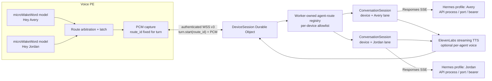

# Future architecture: multiple wake words and Hermes agent routing

## Status

This is a **stretch-goal design**, not an implemented feature. Realtime v2 currently compiles one `Okay Nabu` model, sends no wake-route identifier, and owns one Hermes conversation lane per device.

The desired behavior is:

| Spoken wake phrase | Stable route | Hermes agent | Independent continuity |
| --- | --- | --- | --- |
| “Hey Avery, do this thing” | `avery` | Avery Hermes profile | Avery response head, sessions, memory and tools |
| “Hey Jordan, do that thing” | `jordan` | Jordan Hermes profile | Jordan response head, sessions, memory and tools |

The wake phrase selects an agent lane. Switching lanes does not erase either lane: returning to Avery may continue Avery's last safe completed conversation, while Jordan's history remains separate.

## Non-negotiable boundaries

1. A wake word is a routing hint, not authentication of the speaker.
2. The device sends only a stable `route_id`; it never selects a URL, bearer, profile path, toolset or arbitrary model.
3. The Worker resolves that ID through a per-device allowlist and fails closed on unknown, disabled or unhealthy routes.
4. Every `(device or authenticated principal, conversation_lane_id)` owns an independent conversation UUID, completed `previous_response_id`, Hermes session metadata, memory key, activity/reset state and journal.
5. A response ID is never copied between agents, profiles or route bindings.
6. A genuinely different agent uses a separate Hermes profile/API process. A request `model` alias alone is not an agent boundary.
7. Only one physical capture/playback turn may own a Voice PE at a time, even though several agent conversations remain durable.

## Research findings

### ESPHome wake-word engine

ESPHome's [`micro_wake_word`](https://esphome.io/components/micro_wake_word/) accepts a `models` list, individual model IDs, enable/disable actions, per-model sensitivity and VAD. Multiple-model support was introduced explicitly in [ESPHome 2024.7](https://esphome.io/changelog/2024.7.0/#microwakeword) and remains present in the validated ESPHome 2026.6 line.

“Hey Avery” and “Hey Jordan” will normally require trained [microWakeWord](https://github.com/kahrendt/microWakeWord) v2 models; an arbitrary STT phrase or an openWakeWord model is not interchangeable with ESPHome's on-device model format. Training provenance, generated samples, evaluation corpus, manifest and TFLite bytes become part of the auditable firmware supply chain.

Important runtime details from the pinned implementation:

- only the first configured wake model is enabled on a fresh device; external-model enablement is subsequently persisted, so listing Avery and Jordan is not enough to activate both ([codegen](https://github.com/esphome/esphome/blob/2026.6.5/esphome/components/micro_wake_word/__init__.py));
- every configured model must use the same manifest `feature_step_size`; mixed models are rejected at validation;
- enabled models infer sequentially over one shared feature stream rather than on parallel cores ([runtime loop](https://github.com/esphome/esphome/blob/2026.6.5/esphome/components/micro_wake_word/micro_wake_word.cpp));
- every enabled model has its own interpreter, tensor arena, variable arena and probability window; every model blob consumes firmware flash even while disabled ([model loader](https://github.com/esphome/esphome/blob/2026.6.5/esphome/components/micro_wake_word/streaming_model.cpp));
- `on_wake_word_detected` receives the manifest's human `wake_word` string, not its YAML model ID; manifests with the same label are indistinguishable through that callback ([model identity and persistence](https://github.com/esphome/esphome/blob/2026.6.5/esphome/components/micro_wake_word/streaming_model.cpp));
- two models can cross threshold for one utterance and queue two detections before `stop_after_detection` takes effect.

The [stock Voice PE configuration](https://github.com/esphome/home-assistant-voice-pe/blob/0579e7b9d8504264719c593474c85447253c9dc1/home-assistant-voice.yaml#L1716-L1775) demonstrates simultaneous primary/command-model behavior with a selected wake model, internal `Stop` model and VAD. Its Home Assistant [`voice_assistant` integration advertises only one selectable external wake word](https://github.com/esphome/esphome/blob/2026.6.5/esphome/components/voice_assistant/voice_assistant.cpp) at a time, but this project does not instantiate `voice_assistant`; local firmware can explicitly enable more than one model. That must be physically qualified because CPU time, probability-window latency and cross-model false accepts grow with the active set.

### Hermes agent boundary

Hermes [profiles](https://hermes-agent.nousresearch.com/docs/user-guide/profiles/) are the real named-agent boundary. Each profile has its own `HERMES_HOME`, configuration, `.env`, `SOUL.md`, skills, sessions, response store, cron state and profile-wide memory. The documented API arrangement is one API server process/port and bearer per profile.

Hermes' Responses `model` field is cosmetic by default. The optional `platforms.api_server.extra.model_routes` feature can map an alias to a different inference provider/model/API key/base URL, but it remains inside the same profile: the SOUL, tools, sessions, built-in memory and response database do not change. Unknown aliases may fall back to the profile default, and the alias is resolved independently on every request rather than inherited through `previous_response_id`. Model routes are appropriate for “Avery fast” versus “Avery deep,” not Avery versus Jordan. These semantics were audited at [`5ecc079`](https://github.com/NousResearch/hermes-agent/tree/5ecc07986f46463ca3096679b03a46402eb19cee).

`X-Hermes-Session-Key` scopes provider-backed long-term memory, but it does not isolate profile-wide identity files. Separate profiles are therefore required when Avery and Jordan must have different identity, memories or tool policy. Profiles are state boundaries, not operating-system sandboxes: on the local terminal backend they may still share the host user's filesystem and CLI credentials unless separately containerized, sandboxed or configured with profile-specific home behavior. See the official [profiles](https://hermes-agent.nousresearch.com/docs/user-guide/profiles/) and [memory](https://hermes-agent.nousresearch.com/docs/user-guide/features/memory/) documentation.

Do not depend on a `/p/<profile>/v1/responses` multiplexer route. The audited API server exposes unprefixed `/v1/*` and `/api/*` routes. Use separate profile processes/ports, optionally placed behind explicit reverse-proxy or Cloudflare Tunnel hostnames.

## Target architecture



`DeviceSession` owns the one physical socket, active turn, microphone/playback flow control and route latch. A `ConversationSession` owns one agent lane's Hermes binding and completed-response state. This is the same device/continuity separation required by future proactive group conversations; it avoids expanding one current per-device state record into an error-prone collection of interchangeable heads.

## Stable identities

| Identifier | Owner | Purpose |
| --- | --- | --- |
| Wake model ID | Firmware build | ESPHome action/configuration handle, such as `avery_wake`. Never sent as agent authority. |
| Manifest wake phrase | Model manifest | Human label returned by ESPHome's current callback, such as `Hey Avery`. |
| `route_id` | Firmware + Worker configuration | Stable protocol selector, such as `avery`; may survive retraining/renaming the acoustic model. |
| `agent_id` | Worker registry | Stable logical Hermes agent identity; normally the same label as the route, but not required. |
| `conversation_lane_id` | Worker registry | Canonical state-owner key. Acoustic aliases may share it only when their complete effective Hermes binding is identical. |
| Hermes profile endpoint | Worker secret/config | Actual API process, port/base URL and bearer selecting the profile. |
| Conversation UUID/head | ConversationSession | Short-term transcript/tool chain for this subject/device and agent. |
| Hermes memory key | Worker registry | Long-term provider-memory scope, defaulting to `agent:<agent_id>:lane:<conversation_lane_id>:voice:device:<device_id>`. |

Several acoustic aliases may intentionally map to one `route_id`, and several route IDs may share one canonical conversation lane only when their profile origin/path, agent ID, model-route alias, binding revision and resolved memory scope are identical. The Worker validates that invariant before becoming healthy; two routes cannot oscillate one lane between different bindings. A ConversationSession name is derived server-side from device/principal plus `conversation_lane_id`, never directly from a client route string. Changing or retraining “Hey Avery” while retaining route/lane `avery` does not itself reset Avery's conversation. Reassigning `avery` to another profile requires an explicit route binding revision and rotates only that lane before its next turn.

## Proposed firmware configuration

The exact schema does not exist yet. A future configuration should reference trusted model IDs rather than handwritten callback strings:

```yaml
micro_wake_word:
  id: mww
  microphone:
    microphone: i2s_mics
    channels: 1
    gain_factor: 4
  # The routed arbiter, not the first callback, owns detector shutdown.
  stop_after_detection: false
  models:
    - model: github://example/wake-models/hey_avery.json@<audited-commit>
      id: avery_wake
      internal: true
    - model: github://example/wake-models/hey_jordan.json@<audited-commit>
      id: jordan_wake
      internal: true
  vad:

hermes_voice:
  id: hermes
  default_route_id: avery
  wake_routes:
    - model_id: avery_wake
      route_id: avery
    - model_id: jordan_wake
      route_id: jordan
```

`internal: true` keeps routing models out of Home Assistant's ordinary one-primary-wake-word selector. The custom component owns an explicit route-enable policy: every configured route defaults enabled after fresh flash/factory reset, an optional encrypted-HA switch updates a separate route preference, and firmware reapplies that policy on every boot. It does not rely on ESPHome's first-model default or accidentally retained model preferences. HA may disable a route locally, but it cannot remap that route to another agent.

At build/setup, the custom component must:

- require unique route IDs and model IDs;
- inspect the referenced model objects/manifests and reject duplicate callback labels that could select different routes;
- require compatible feature step sizes and pinned model manifests/TFLite bytes;
- expose a deterministic route-manifest hash for the gateway handshake;
- refuse a detected label not present in the compiled mapping rather than using the default agent.

Because ESPHome's public trigger currently supplies only the manifest phrase, the component resolves that trusted phrase against its compiled model-to-route table. If ESPHome later exposes model ID/confidence directly, prefer that stronger event. Raw wake phrases are not sent to the Worker or logged as transcripts.

The route-manifest hash covers protocol/schema version, every compiled route/model ID, model-manifest and TFLite SHA-256, acoustic parameters and default route mapping. Runtime enable/disable state is reported separately and does not change the build hash.

## Detection arbitration

One utterance can trigger more than one enabled model. With `stop_after_detection: true`, ESPHome requests shutdown on the first delivered callback; it may drain another event already queued from that inference step, but a model crossing threshold on a later feature step may never be observed. That cannot support the promised fail-closed arbitration.

The preferred implementation extends the pinned `micro_wake_word` external component with one atomic per-feature `DetectionBatch`. It contains a monotonically increasing detection epoch/sample position and every enabled model's trusted ID, probability/threshold result and confidence. The arbiter examines the whole batch before it stops inference:

1. if every threshold-crossing candidate resolves to one route, latch it once and stop wake inference;
2. if distinct routes cross threshold, select a winner only when a physically validated confidence-margin rule is satisfied; otherwise fail closed, play a short ambiguity cue and return to wake-ready;
3. never select whichever model happens to be evaluated or delivered first;
4. discard callbacks/results from a detection epoch after it has been accepted, rejected or superseded;
5. never fall back to the button/default route after an ambiguous acoustic detection.

If the upstream phrase-only callback is retained as an interim implementation, `stop_after_detection` remains `false` and the arbiter owns a measured full interval long enough to observe later model callbacks. It must tag one detection epoch and stop/discard all late callbacks after its decision. Because waiting after the first threshold can clip “do this thing,” firmware also needs a bounded, device-only channel-0 PCM pre-roll covering the arbitration interval; it is released into capture only after one route is accepted and otherwise erased. If that timing/pre-roll cannot be made reliable, phrase-only routing is not releasable—requiring users to pause after the name is not an acceptable hidden workaround.

## Worker route registry

The following is a conceptual Worker secret, not current configuration:

```json
{
  "avery": {
    "agent_id": "avery",
    "conversation_lane_id": "avery",
    "profile_base_url": "https://hermes-avery.example.com",
    "profile_api_key": "<secret>",
    "advertised_model": "avery",
    "model_route": null,
    "binding_revision": "avery-2026-07-11.1",
    "session_key_template": "agent:avery:voice:device:{device_id}",
    "tts_voice_id": "<optional-elevenlabs-voice>"
  },
  "jordan": {
    "agent_id": "jordan",
    "conversation_lane_id": "jordan",
    "profile_base_url": "https://hermes-jordan.example.com",
    "profile_api_key": "<secret>",
    "advertised_model": "jordan",
    "model_route": null,
    "binding_revision": "jordan-2026-07-11.1",
    "session_key_template": "agent:jordan:voice:device:{device_id}",
    "tts_voice_id": "<optional-elevenlabs-voice>"
  }
}
```

A separate `DEVICE_AGENT_ROUTES_JSON` maps authenticated device IDs to permitted route IDs, the default button route, and one or more accepted `route_manifest_sha256` values for audited firmware builds. Neither object is device-supplied. The Worker compares the client-reported hash with this trusted expected set; without an expected value the hash is diagnostic only. This is drift detection rather than hardware attestation—a compromised firmware/token can still lie unless a future secure-attestation mechanism is added.

Provider keys remain Worker secrets. The Durable Object persists only a non-secret binding fingerprint containing agent ID, conversation lane ID, normalized profile origin/path, advertised/model-route alias, binding revision and resolved memory key. All routes sharing a lane must produce the exact same fingerprint; otherwise health/configuration fails before accepting voice.

API bearer rotation at an otherwise unchanged agent binding does not rotate history. Endpoint/profile, agent ID, binding revision or resolved memory-key changes rotate only that canonical lane's UUID/head before its next accepted turn. An optional `model_route` must be validated locally, sent on every request and included in the fingerprint; unknown aliases are rejected by the Worker rather than allowed to reach Hermes' silent default fallback.

## Draft realtime protocol

Agent routing changes conversation ownership, so it belongs in the single negotiated future [`hermes-voice.realtime.v3` roadmap](protocol-v3-roadmap.md), shared with proactive delivery, rather than an undocumented v2 field.

```text
C  hello(firmware, route_manifest_hash, compiled_route_ids, locally_enabled_route_ids)
S  ready(accepted_route_ids, route_registry_revision)
C  route.state(route_manifest_hash, locally_enabled_route_ids)  # after a local setting change
S  route.state.done(accepted_route_ids, route_registry_revision)
C  turn.start(turn_id, route_id, start_reason=wake_word|button)
S  turn.ready(turn_id, route_id, agent_id, conversation_lane_id, conversation_id)
C  binary PCM input 0..N
S  ... ordinary streaming transcript/Hermes/TTS controls and PCM ...
C  conversation.reset(route_id, request_id)       # idle only
S  conversation.reset.done(route_id, conversation_lane_id, request_id, conversation_id)
```

The Worker first validates the reported route-manifest hash against the expected values stored for that authenticated device, then intersects the compiled/enabled sets with its route allowlist. A mismatch disables only the affected routes when that can be represented unambiguously; an unexpected manifest hash or no allowed route means the socket is not voice-ready. Local enablement is a user-experience control, not a security claim—a compromised firmware/device credential can lie, so the Worker allowlist remains authoritative. `turn.start.route_id` is fixed for the entire turn, resolved to one canonical conversation lane, echoed by the server and stored in the journal. All later audio/control frames remain fenced by turn ID and the server's latched lane.

The binary PCM layout and streaming/backpressure pipeline can remain otherwise unchanged. Route selection happens before Scribe opens and adds no provider-stage buffering.

Short center-button start uses a configured, visible `default_route_id`; it never means “whichever agent was used most recently.” With no proactive attachment, the existing medium-hold reset likewise targets that default personal route; while attached it fails closed until explicit detach. Home Assistant should expose explicit **New Avery Conversation** and **New Jordan Conversation** controls so resetting one agent is never ambiguous.

## Conversation behavior

Each canonical conversation lane independently applies the existing completed-only rules:

- the first Avery turn omits `previous_response_id`; later Avery turns use Avery's last exact completed response;
- Jordan follows the same rule against Jordan's own store/profile;
- wake, reconnect, reboot, cancel and same-agent barge-in do not reset that agent's lane;
- explicit route-specific reset, that lane's enabled idle expiry, missing head, or that lane's binding change rotates only that lane;
- activity in Jordan does not refresh Avery's idle timer;
- incomplete/failed/cancelled Avery candidates never become Jordan—or Avery—parents;
- an unavailable selected profile fails that turn without falling back to another profile or model.

Switching agents while idle selects the destination lane's existing safe head. If cross-agent barge-in is enabled, saying “Hey Jordan” while Avery is thinking/speaking cancels Avery's transport/output, preserves Avery's prior safe head unless Avery already completed, and starts a new Jordan turn from Jordan's own safe head. If Avery completed before playback cancellation, Avery's head remains promoted under the existing agent-completion rule.

For initial release, only the active route's model should remain enabled while its reply is playing, preserving same-agent barge-in while reducing CPU and self-trigger risk. Cross-agent wake during playback should be opt-in only after XMOS/AEC and false-trigger testing; center-button cancellation remains the dependable route-switch escape. At idle, every enabled routing model runs.

## Combined DeviceSession precedence

Wake routing and proactive attachments share one physical `DeviceSession`; they cannot define competing button/wake behavior. The combined state machine is:

| Current state | Event | Required transition |
| --- | --- | --- |
| Idle, no attachment | Named wake route R | Reserve R's personal conversation lane, then issue routed `turn.ready`. |
| Idle, no attachment | Short button | Reserve the configured default personal lane. |
| Proactively attached to lane P | Short button or wake resolving to P | Continue P using its attachment lease. |
| Proactively attached to P | Wake resolving to different lane R | Treat as an explicit switch: cancel transient P audio/turn, durably detach/release P, then reserve R. Capture/audio cannot start until all fences succeed. |
| Active P turn/playback | Same-lane wake | Existing same-lane barge-in rules; retain P's last safe completed head. |
| Active P turn/playback | Different-lane wake | Only when cross-agent barge-in is enabled: cancel P, detach any proactive P lease, then reserve R. Otherwise reject/ignore and retain button cancellation. |
| Any proactive attachment | Medium reset hold | Reject with a distinct cue until **End proactive conversation** detaches; never reset a shared/group lane implicitly. |
| No attachment, idle | Medium reset hold | Reset the configured default personal lane only. |

The `DeviceSession` installs one monotonically versioned transition/lease epoch. Releasing an attached ConversationSession and acquiring a destination lane is a fenced compensating saga, but it is atomic from the device protocol's perspective: either the new `turn.ready` is returned with the destination epoch or no capture turn begins. A failed/ambiguous detach cannot leave two active leases and never routes Jordan audio into Avery's attached/group chain. Reconnect restores at most one still-valid attachment/active lane.

## Hermes profile deployment

Recommended deployment:

```text
Hermes profile Avery  -> API server 127.0.0.1:8642 -> Tunnel hostname/path A
Hermes profile Jordan -> API server 127.0.0.1:8643 -> Tunnel hostname/path B
Cloudflare Worker agent registry -> explicit A or B origin + corresponding bearer
```

Configure each profile's SOUL, model, tools, skills, memory, terminal backend, sandbox and approval policy independently. Use separate OS users/containers or stronger terminal isolation if filesystem/credential separation matters; merely creating profiles does not enforce that boundary.

If Honcho should share knowledge of one human between agents, configure that deliberately while retaining distinct AI peers/session keys. For strict agent/user memory separation, use separate profiles and separate Honcho workspaces. Do not rely on different session-key strings to isolate profile-wide `MEMORY.md`/`USER.md`.

## Security and privacy

- Anyone who can speak the wake phrase can select that route. “Hey Avery” must not grant Avery-only privilege.
- A device bearer authenticates hardware and may select only its Worker allowlist; it does not prove that a real acoustic wake event occurred.
- Give every profile the narrowest useful toolset/sandbox. Sensitive tools still require speaker verification, PIN, trusted UI approval or another stronger factor.
- Never silently fall back from an unavailable privileged/restricted agent to a more permissive agent.
- Do not accept profile URLs, API keys, memory keys, tool policies, model aliases or binding revisions from firmware.
- Pin and audit wake-model manifests/bytes. A model update changes the device's acoustic attack surface even when it intentionally preserves the route's conversation.
- Record route ID, opaque turn ID, latency and outcome only. Do not log audio, detected utterance, transcript, agent response or credentials.
- Treat per-agent LED colors and TTS voices as user feedback, not security indicators.

## Relationship to proactive delivery and Home Assistant

Future Hermes-initiated conversation delivery has no acoustic wake event, so its trusted delivery policy must name an explicit Worker-owned `conversation_lane_id` (and its canonical agent binding). An announcement may choose a configured voice without touching any conversation lane. A contextual invitation runs inside exactly the selected lane; a later different wake route is an explicit switch, never an implicit merge.

Home Assistant remains an optional media/control plane. It may expose route enable switches, the default button route, per-agent reset buttons and diagnostic availability, but it cannot edit the Worker agent registry or receive Hermes/ElevenLabs credentials. Music and announcements continue through their independent mixer inputs regardless of the selected agent.

## Failure and recovery rules

- A client-reported route manifest not present in that device's Worker-owned expected hash set fails before capture or provider use; it never selects the default route silently.
- A profile outage affects only its route. Other agent conversations and HA media continue.
- Reconnect restores every lane's prior completed head but never resumes an ambiguous audio turn.
- An exact route-specific missing-previous-response error rotates/fails only that lane and never replays the utterance; a generic `404` preserves the lane head.
- A Worker configuration change uses the stored binding revision to fence old response IDs before contacting the new profile.
- Agent-registry revisions take effect only between turns. The Worker closes/re-handshakes affected device transports or sends a required versioned registry-change control; it never remaps a latched in-flight route.
- A wake-model retrain/rename with unchanged stable route does not reset conversation state, but requires a new firmware manifest hash and acoustic qualification.
- Co-detection of different routes produces an ambiguity result, not two turns.
- One globally active device turn and per-lane leases prevent simultaneous Avery/Jordan tool turns from one Voice PE.

## Suggested implementation sequence

1. Train/audit two microWakeWord v2 models with the same feature step size; pin manifests and TFLite bytes.
2. Extend/pin the wake component to expose atomic model-ID/confidence detection batches (or implement the qualified phrase-callback/pre-roll fallback), then add model-to-route mapping, explicit boot enablement, expected-manifest hashing and detection epochs.
3. Add protocol v3 route negotiation, routed start/reset controls and firmware validation while retaining the existing PCM framing.
4. Introduce `DeviceSession` transport ownership and route-specific `ConversationSession` state or an equivalently fenced per-route store.
5. Add the Worker agent registry, device allowlists, secret profile credentials, binding revisions and fail-closed health checks.
6. Run distinct Avery/Jordan Hermes profile API processes and Tunnel routes; verify SOUL, tool, response-store and memory separation.
7. Add optional per-agent ElevenLabs voices, LED feedback and HA route controls only after core isolation works.
8. Physically qualify all-active idle inference and same-/cross-agent barge-in behavior on Voice PE hardware.

## Release-blocking acceptance tests

- Both configured models are enabled after fresh flash, reboot, OTA and factory reset; disabled/unknown models cannot route.
- Build validation rejects mixed feature steps, duplicate/conflicting route/lane bindings, conflicting callback labels, unpinned models and missing default route.
- Worker health rejects two routes that share one `conversation_lane_id` but resolve to different agent/profile/model-route/revision/memory bindings.
- Collect a confusion matrix for Avery, Jordan, near-negative names, shared “Hey” prefixes, television/podcast audio and device TTS in quiet/noisy/far-field conditions.
- A true Avery utterance never opens Jordan; a true Jordan utterance never opens Avery; distinct co-detection fails closed and produces one ambiguity cue.
- Measure inference time, 120 ms ring resets, queue pressure, heap/PSRAM high-water marks and wake latency with each model alone and all idle models enabled.
- `hello` with an unexpected manifest hash and `turn.start` for an unlisted route, a route disabled on the device, or a device not allowlisted for that route fail before STT/Hermes/TTS.
- Avery A1 -> Jordan J1 -> Avery A2 proves A2 receives only Avery's chain and J1 receives only Jordan's. Include harmless, route-distinct tool results in the fixture.
- Reset, idle expiry, missing response and binding change for Avery leave Jordan's UUID, head, session metadata and activity untouched, and vice versa.
- An unknown `model_route` cannot reach Hermes' default model; every configured alias is sent on every turn and included in binding tests.
- Kill each profile independently and prove no fallback/cross-route request occurs; the healthy agent and HA media remain available.
- Attempt direct protocol route selection with a valid device token and prove the Worker allowlist—not the claimed wake event—controls availability.
- Verify profile-wide `MEMORY.md`, `USER.md`, response databases and configured Honcho workspaces have exactly the intended isolation/sharing policy.
- During Avery playback, test self-trigger, same-agent barge-in and opt-in cross-agent barge-in with real XMOS AEC. Until it passes, cross-agent playback wake remains disabled.
- Inject different-agent wake, button, reset, disconnect and lease failures at every proactive attached/active transition; prove the old lane is detached before the new lane is ready, no audio enters the wrong lane, and at most one lease survives recovery.
- The default center-button route and every per-agent reset control are deterministic, visible and idempotent.
- Realtime proof remains valid: microphone frames stream while speaking, Hermes starts after committed STT, first TTS phrase precedes agent completion, and first PCM precedes TTS final for both agents.

## Decisions required before implementation

- Audited microWakeWord models and pronunciations for “Hey Avery” and “Hey Jordan.”
- Maximum simultaneously enabled idle models; begin qualification with two rather than assuming the schema's unbounded list is practical.
- Default button route and whether users may change it through encrypted Home Assistant control.
- Per-agent ElevenLabs voices and LED colors.
- Whether cross-agent barge-in during playback is disabled, same-route-only or fully enabled after physical testing.
- Per-agent idle/reset policies and whether any authenticated human memory is intentionally shared across devices/profiles.
- Container/OS/tool sandbox boundaries for agents with meaningfully different privileges.
