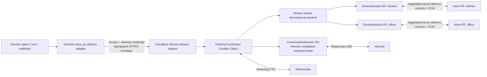

# Future architecture: Hermes-initiated delivery

## Status

This is a **stretch-goal design**, not an implemented feature. Realtime v2 remains entirely device-initiated: the gateway sends audio only after an authenticated Voice PE starts a turn. No current Worker route, Hermes adapter, or firmware control permits unsolicited playback or microphone capture.

The future feature has two distinct modes:

| Mode | User-visible behavior | Hermes conversation effect |
| --- | --- | --- |
| Announcement | Speak a bounded message on one device or a configured group, then stop. | None. It must not read, clear, fork, or advance `previous_response_id`. |
| Conversation invitation | Hermes speaks first and offers the user a chance to reply. | The proactive Hermes response becomes a completed turn in exactly one owned conversation; the user's next reply chains from it. |

Keeping these modes separate is a hard semantic requirement. An announcement is not a conversation merely because an agent wrote the text.

## Why this needs a gateway extension

Current upstream Hermes supports several useful automation primitives:

- the authenticated [Jobs API](https://hermes-agent.nousresearch.com/docs/user-guide/features/api-server/#jobs-api-background-scheduled-work) can create and run scheduled/background jobs;
- [Cron](https://hermes-agent.nousresearch.com/docs/user-guide/features/cron/) runs scheduled agent or script jobs and delivers their output to configured platforms;
- [webhook automation](https://hermes-agent.nousresearch.com/docs/user-guide/messaging/webhooks/) can turn an inbound event into an agent run and platform delivery;
- [gateway hooks](https://hermes-agent.nousresearch.com/docs/user-guide/features/hooks/) can observe lifecycle events and call an external HTTPS service.

Hermes cron jobs run in a fresh isolated agent session by default. Hermes can opt a delivery into a continuable chat session on supported platforms, but broadcast delivery is deliberately not continuable. The current Responses and Sessions APIs expose request/run streams to their caller; audited commit [`5ecc079`](https://github.com/NousResearch/hermes-agent/tree/5ecc07986f46463ca3096679b03a46402eb19cee) has no persistent outbound channel into this Worker's idle per-device Responses chain.

The preferred Hermes-side integration is therefore a small `voice_pe` [platform-adapter plugin](https://hermes-agent.nousresearch.com/docs/developer-guide/adding-platform-adapters). Its `send()` implementation posts an authenticated delivery envelope to the Worker. It should register a cron home target and standalone sender so cron delivery also works outside a live gateway adapter. Cron auto-delivery, webhook cross-platform delivery, and the operator-facing `hermes send` command can then use the same adapter. An autonomous agent can schedule that delivery through Hermes' `cronjob` tool; immediate arbitrary outreach requires an explicit, separately permissioned `voice_delivery` plugin tool. The design must not assume generic agent access can invoke an unrestricted send engine. A gateway hook that posts directly is acceptable for non-critical experiments, but hooks are non-blocking observers and should not be the durable delivery queue.

Ordinary platform `send()` and cron/webhook auto-delivery always map to **announcement** mode. They cannot turn arbitrary final text or transport metadata into a contextual invitation. **Conversation** mode is available only through the explicit event schema and its separately authorized tool/automation path. The target proactive Responses run excludes `voice_delivery` and equivalent delivery tools and carries a bounded origin/hop marker, preventing recursive self-delivery.

These interfaces were checked at audited Hermes commit [`5ecc079`](https://github.com/NousResearch/hermes-agent/tree/5ecc07986f46463ca3096679b03a46402eb19cee). A future implementation must pin and re-audit an exact commit or container digest rather than rely on a semantic-version floor.

## Proposed architecture



The current `VoiceSession` Durable Object combines device transport and Hermes conversation ownership. Proactive one-to-many conversations make those separate concerns:

- `DeviceSession` owns the authenticated socket, device availability, local-policy result, output credit, and playback outcome.
- `ConversationSession` owns one Hermes binding, stable memory scope, conversation UUID, completed response head, and turn journal.
- `DeliveryCoordinator` owns one idempotent request, a snapshot of resolved targets, expiry, per-target outcomes, and any first-responder lease.

Migration can initially map each device to one same-named conversation session, preserving current behavior. A logical group or user-scoped conversation can later attach more than one device without copying one response head into unrelated per-device histories.

## Hermes trigger and delivery contract

The following is a draft application contract, not a currently accepted route:

```http
POST /v1/deliveries HTTP/1.1
Authorization: Bearer <separate-Hermes-delivery-token>
CF-Access-Client-Id: <service-token-id>
CF-Access-Client-Secret: <service-token-secret>
Idempotency-Key: <uuid-v4>
Content-Type: application/json
```

Announcement example:

```json
{
  "v": 1,
  "delivery_id": "5e1f82a8-1b65-4c8c-94f3-820b6f3ef186",
  "mode": "announcement",
  "target": "group:downstairs",
  "text": "The garage door has been open for ten minutes.",
  "priority": "normal",
  "expires_at": "2026-07-11T09:15:00Z",
  "source": {"kind": "hermes_cron", "id": "garage-watch"}
}
```

Conversation example:

```json
{
  "v": 1,
  "delivery_id": "8b0e529a-d731-4a23-a8b5-2115644f7da0",
  "mode": "conversation",
  "target": "device:kitchen",
  "event": {
    "type": "reminder_due",
    "fields": {
      "subject": "Airport departure",
      "due_at": "2026-07-11T09:05:00Z",
      "note": "The planned departure time has arrived."
    }
  },
  "conversation_policy": "continue",
  "listen_policy": "device_default",
  "priority": "normal",
  "expires_at": "2026-07-11T09:15:00Z"
}
```

The caller supplies a Worker-owned target alias and an allowlisted event schema, never raw Durable Object IDs, `previous_response_id`, `X-Hermes-Session-Key`, provider credentials, voice IDs, audio URLs, SSML, or free-form system instructions. The Worker resolves targets, voices, long-term-memory scopes, quiet hours, rate limits, event templates, and permissions from operator configuration.

`Idempotency-Key` must exactly equal `delivery_id`; there is one canonical delivery identity. The Worker stores an immutable request fingerprint, returns `202 Accepted` with that ID and a status resource, and returns the existing record for an identical retry. Reusing the ID with different content is a conflict. A tombstone survives for at least the maximum delivery TTL plus the documented caller retry horizon and clock-skew allowance, so an old retry cannot become a new delivery merely because its full terminal record was compacted.

Idempotency prevents creation of a second logical delivery, but it cannot prove exactly-once human-audible playback. If audio played and the final acknowledgement was lost, replay would be a duplicate. The delivery state machine therefore becomes at-most-once after a durable per-target `audio_started` fence:

1. before output frame zero, both the coordinator and `DeviceSession` persist the delivery ID and `audio_started` state; a partial or ambiguous cross-object fence is conservatively treated as started/unknown and never auto-replayed;
2. firmware keeps a small persistent delivery-ID deduplication ledger as a supplementary reboot/reconnect fence;
3. if no `audio_started` record exists, an unexpired offer may safely be retried;
4. after `audio_started`, loss of the socket/ack becomes terminal `playback_unknown` and is never replayed automatically;
5. only `delivery.drained` produces `played`, which still means transport playback drained rather than proof that a person heard it.

The delivery ingress should use a dedicated Access-protected hostname or route policy. Do not accidentally put the device WebSocket behind a service-token policy that the Voice PE cannot satisfy, and do not reuse the separate Access credentials the Worker uses when calling the private Hermes origin.

## Exact conversation semantics

### Announcement

The adapter provides final, bounded speakable text. The Worker sanitizes it, synthesizes it, and offers it to each target. It never calls Hermes on the target's behalf and never changes the target's conversation UUID, binding, Hermes session metadata, or completed response head. The next ordinary user utterance remains a reply to whatever completed turn preceded the announcement.

This mode is suitable for reminders, monitoring alerts, timers, doorbells, and broadcast status. `[SILENT]` or an empty successful automation result should suppress creation of the delivery rather than producing silence on a device.

A cron/webhook job's already-generated final output may enter this announcement lane, but it is never copied or promoted as the target Voice PE conversation head. Hermes generated it in a different isolated job/session, so treating it as the target's contextual assistant turn would fabricate continuity.

### Conversation invitation

A contextual invitation carries a structured event, not an already-spoken assistant answer. After an eligible device accepts the offer and the conversation lease is held, the `ConversationSession` renders that event through a fixed, audited template and starts a normal Hermes `POST /v1/responses` turn:

- `conversation_policy: continue` supplies the session's last completed `previous_response_id`;
- `conversation_policy: new` first rotates the short-term conversation UUID/head while retaining its configured long-term-memory key;
- the event is represented explicitly in the stored transcript so Hermes knows why it spoke;
- Hermes text streams through the existing phrase/TTS pipeline;
- only exact `response.completed` promotes the proactive response as the new head;
- the user's accepted reply supplies that proactive response ID as `previous_response_id`.

This is what makes the exchange an ongoing Hermes conversation rather than an announcement followed by an unrelated wake turn.

The device offer must be accepted before starting the Hermes turn. That avoids advancing context for an offline, muted, busy, or quiet-hours device that could never hear the invitation. Acceptance is provisional: its `DeviceSession` transaction installs a reservation that blocks ordinary turns, then the coordinator compare-and-swaps a lease against the expected `ConversationSession` head/version. Only after both reservations are durable does the gateway confirm/start the invitation. If the conversation CAS fails, it releases the device reservation and withdraws the offer without calling Hermes. Cross-object recovery treats these leases as a compensating saga; no provider request starts while only one side is reserved.

Once Hermes completes, promotion remains tied to agent completion rather than successful TTS drain, matching the current safety rule. If the durable output fence proves frame zero never started, record `completed_not_started`; recovery may fetch and re-synthesize that completed Hermes response without rerunning the agent or its tools. If failure occurs after `audio_started`, record `playback_unknown` and do not replay automatically. A user/operator may explicitly request **Repeat**, which creates a new delivery ID and re-synthesizes the stored completed answer while warning that prior playback may have been heard; it never reruns Hermes.

The conversation lease excludes an ordinary device-initiated turn, explicit reset, idle rotation, and another proactive invitation. There is no automatic retry after `response.created`, because tools may already have caused side effects.

The device must not open a reply window until Hermes has completed safely and invitation playback has drained. If the user cancels or tries to barge in before the proactive response completes, the invitation is aborted, its candidate is not promoted, and any later ordinary turn continues from the prior safe head. Partial spoken text is never treated as a completed conversational parent.

## One or more devices

Announcements naturally fan out. The coordinator snapshots group membership when it accepts the request and tracks `played`, `expired`, `busy`, `muted`, `offline`, and `failed` separately for every target. Initial implementation should synthesize per device because voices and output policy may differ; shared PCM fan-out is only a later optimization for identical voice/format settings and must retain independent output backpressure.

Interactive fan-out is different. Copying one proactive response ID into several unrelated per-device heads would create divergent reply branches, could cross different memory scopes, and makes tool ownership ambiguous. The supported designs should be:

1. **Single-device continuation:** `conversation_policy: continue` targets exactly one existing conversation.
2. **Group invitation:** a group-owned `ConversationSession` starts a new contextual chain. Every eligible device may play the invitation, but the first device to make an explicit reply claim obtains a lease through an atomic compare-and-swap. `delivery.claimed` returns an opaque conversation-session ID, lease epoch, and claim token. The device must wait for that control before recording/sending reply audio. Other devices receive a withdrawal and cannot submit audio into that conversation. Subsequent replies play on the winning device unless policy explicitly requests group playback.

Every conversational group has an explicit Worker-owned Hermes base/model binding, long-term-memory session key, and device allowlist. It never inherits those values from the first target or first responder; members' personal per-device session keys remain untouched and may differ. A group without that explicit configuration is rejected for conversation mode while still being eligible for context-free announcements. A group conversation must not later be silently merged into a device's divergent pre-existing response chain; continuation remains owned by the group session until an explicit boundary or a separately designed, compare-and-swap handoff.

One device may have at most one offered/attached contextual invitation. Additional invitations are queued or rejected with a visible status; the user is never asked to guess which prompt a reply belongs to. A single-device invitation receives an attachment token directly; a group invitation receives one only after winning the claim. The `DeviceSession` persists that attachment's delivery ID, ConversationSession ID, lease epoch/token, and expiry. A reply uses a dedicated delivery-reply start carrying those fields, and the gateway rejects audio sent before attachment/claim acknowledgement or with a losing, delayed, mismatched, detached, or expired token.

While attached, a short button or wake resolving to the attached agent/lane uses `delivery.reply.start`, continuing that ConversationSession with its current lease token. A distinct named wake route is an explicit switch: the `DeviceSession` must cancel transient attached output/turn state, durably detach/release the proactive lease, and only then acquire the destination personal lane; if any fence is ambiguous, no new capture begins. Its ordinary personal conversation remains paused and unchanged until that transition. Explicit **End proactive conversation**, configured attached-session idle expiry, maximum session lifetime, operator cancellation, or an invalid lease detaches it and restores its personal conversation. Reconnect restores only one still-valid server-side attachment. Existing personal `conversation.reset` is not overloaded to reset a shared group: firmware rejects reset until detach, while a group reset is a separately authorized operation targeted to the group ConversationSession. These combined precedence, attach/detach and targeted-reset rules are release prerequisites, not deferred product polish; see [`multi-agent-wake-routing.md`](multi-agent-wake-routing.md#combined-devicesession-precedence).

For privacy and predictability, group invitations default to wake-word/button reply rather than automatically opening microphones on every device.

## Device protocol direction

Server-initiated playback changes turn ownership enough that it belongs in the single negotiated [`hermes-voice.realtime.v3` roadmap](protocol-v3-roadmap.md), shared with multi-agent routing, rather than an accidental extension of v2. A draft exchange is:

```text
S  delivery.offer(delivery_id, mode, expires_at, priority)
C  delivery.accept(delivery_id) | delivery.reject(delivery_id, reason)
S  delivery.audio.start(delivery_id, server_turn_id)
S  binary output frames 0..N
C  output.ack(server_turn_id, seq)
S  delivery.audio.end(delivery_id, last_seq, reply_policy)
C  delivery.drained(delivery_id)
# Single target: server grants the pre-reserved attachment
S  delivery.attached(delivery_id, conversation_session_id,
                     lease_epoch, claim_token)
C  delivery.claim(delivery_id)                    # conversational group only
S  delivery.claimed(delivery_id, conversation_session_id, lease_epoch, claim_token)
   | delivery.withdrawn
C  delivery.reply.start(delivery_id, conversation_session_id,
                        lease_epoch, claim_token, turn_id)
C  delivery.detach(conversation_session_id, lease_epoch, claim_token)
S  delivery.detached(conversation_session_id)
```

Existing PCM framing and consumption-credit behavior can be reused after `delivery.audio.start`, but the server-generated turn namespace and delivery lifecycle must be unambiguous. A single target waits for `delivery.attached`; a group member waits for `delivery.claimed`. The attachment/claim token routes its audio to that `ConversationSession` rather than its personal chain. A device that did not negotiate the capability never receives an offer or unsolicited PCM.

For a group claim, the ConversationSession claim CAS and the winning `DeviceSession` attachment are persisted before `delivery.claimed` is emitted. A reconnect/repeated claim with the same delivery/device is idempotent and returns the same still-valid epoch/token; any partial claim state is reconciled without admitting a second winner.

The device reports policy outcomes rather than allowing the server to override them. Required local states include `busy`, `muted`, `quiet_hours`, `disabled`, and `unsupported`. Firmware must clear queued proactive audio on mute, button cancellation, disconnect, or a winning claim elsewhere.

## Listening, consent, and user experience

An announcement never starts capture. A conversation invitation ends with one of these device-owned policies:

- `wake_word` — default; LED/earcon indicates that the user may answer using the normal wake phrase or button;
- `after_prompt` — explicit per-device opt-in; after playback drains, emit an audible listening cue and open one short VAD-bounded reply window;
- `disabled` — the device can play announcements but cannot accept proactive conversations.

The remote delivery cannot elevate `wake_word` to `after_prompt`. Physical mute always wins. An automatically opened reply window must be visibly and audibly indicated, time out within a configured bound, and never remain an ambient open microphone. Quiet hours, maximum deliveries per interval, allowed source/target pairs, and emergency-priority behavior are operator/device policy rather than model choices.

The default priority queues until the device is idle and expires if its TTL elapses. It never interrupts active capture, tool execution, Hermes playback, or another conversation. Any future emergency preemption requires a separate operator allowlist and cannot be selected merely by agent-generated text.

## Security boundaries

- Use a separate outbound delivery credential; never reuse a device token, `HERMES_API_KEY`, or `ELEVENLABS_API_KEY`.
- Protect the ingress with TLS, Cloudflare Access, application authentication, request-size limits, timestamp/expiry checks, and durable idempotency.
- Resolve target groups and permitted modes in Worker configuration. A compromised agent/tool must not enumerate or address arbitrary hardware by guessing an ID.
- Treat webhook/event fields as data. Render them through fixed templates; do not concatenate untrusted payloads into system instructions.
- Bound text, event fields, target count, pending deliveries, TTL, and provider spend. Never fetch a caller-provided audio URL.
- Audit only delivery ID, source class, target alias, timing, outcome, and byte counts. Do not log spoken text, Hermes tool arguments/results, audio, or credentials.
- Existing Hermes tool sandbox/approval policy still applies. A proactive trigger is not permission to auto-approve a dangerous action.
- Device authentication identifies hardware, not the person who heard or answered it. Sensitive actions still require stronger user authorization.
- Install one delivery path for each source. Do not combine platform auto-delivery with a post-LLM forwarding hook, or a successful cron/ordinary turn can be delivered twice despite each individual path being correct.
- Disable the delivery tool during a target proactive Responses run, reject the active source conversation as an immediate recursive target, and enforce a hop/depth limit plus per-source rate limits.

## Availability and retry rules

- Persist a bounded pending envelope, not synthesized PCM. An offline device may receive an unexpired offer after reconnect. Delete announcement/event content at the terminal outcome or expiry; retain only the minimum idempotency/outcome tombstone through the TTL-plus-retry window.
- An ingress retry is safe only through the same `delivery_id`/`Idempotency-Key`; the coordinator returns the existing state.
- A rejected, expired, or pre-Hermes failed invitation does not touch conversation state.
- After Hermes creates an in-flight response, use the existing journal/reconciliation rules and never automatically replay the event.
- Before frame zero, reservation recovery may retry safely. After durable `audio_started`, any ambiguous disconnect becomes `playback_unknown` and cannot trigger automatic replay; a manual repeat uses a new delivery ID.
- Device `delivery.drained` means playback drained according to the firmware contract, not that a human heard or understood it.
- Multi-target success is partial by design. The status resource reports each target; it does not roll back devices that already played.
- Hibernating device objects may wake for delivery. Outbound TTS and Hermes sockets remain short-lived.

## Relationship to Home Assistant

The direct Worker path should remain independent of Home Assistant. This preserves delivery when HA is unavailable and allows a contextual Hermes turn to use the same durable response chain as ordinary voice.

As an interim announcement-only option, a Hermes Home Assistant tool can invoke the existing HA announcement media path. That requires HA, provides different delivery/error semantics, and does not place the message in the Voice PE Hermes conversation. It must not be presented as implementation of proactive conversation.

Home Assistant may later provide operator controls for opt-in, quiet hours, target groups, pending delivery visibility, and cancellation, but it must not receive Hermes/ElevenLabs secrets.

When wake-word-selected agents are also configured, every contextual proactive delivery names an explicit Worker-owned `conversation_lane_id`/ConversationSession and its canonical agent binding because no acoustic wake event exists. A platform-delivered announcement remains context-free even if it uses an agent-specific TTS voice. Never infer a contextual lane from message text or a display name; see [`multi-agent-wake-routing.md`](multi-agent-wake-routing.md).

## Suggested implementation sequence

1. Pin Hermes by audited commit/container digest and confirm the platform/plugin, Cron, Jobs, webhook, and delivery contracts used by that release.
2. Add authenticated/idempotent Worker ingress, target aliases, a `DeliveryCoordinator`, status retrieval, quotas, expiry, and audit metadata.
3. Add negotiated firmware/server delivery controls and single-device, context-free announcements.
4. Add group announcement fan-out with independent per-device flow control and outcomes.
5. Split device transport from conversation ownership and add single-device contextual invitations.
6. Add device opt-in reply policies and validate physical mute, cues, endpointing, AEC, and cancellation.
7. Add group-owned conversations and first-responder claiming; do not approximate this by cloning heads.
8. Package the Hermes `voice_pe` platform/delivery plugin with its cron home-target and standalone-sender registration, plus an optional separately permissioned `voice_delivery` tool. Then connect Cron/Jobs and webhook automation. Do not depend on generic `send_message` being model-callable or add a duplicate post-LLM forwarding hook.

## Release-blocking acceptance tests

- An announcement changes no conversation UUID, response head, session metadata, binding, or idle activity timestamp.
- The ordinary turn after an announcement still chains from the pre-announcement completed response.
- A conversational invitation continues from exactly the selected completed head or performs one explicit new-conversation rotation; its user reply chains from the completed proactive response.
- Failed, cancelled, expired, duplicated, and ambiguous proactive turns obey the current completed-only promotion and no-replay rules.
- An identical ingress retry never creates a second logical delivery. Before `audio_started`, recovery may retry; afterward acknowledgement loss/restart/reconnect produces `playback_unknown` and no automatic replay. Tests must not claim unattainable exactly-once audible delivery.
- Busy, muted, disabled, quiet-hours, and offline policies work without starting Hermes/TTS unnecessarily.
- Physical mute and an unnegotiated/disabled listening policy make automatic capture impossible.
- A group announcement reaches each accepted target with independent backpressure; one slow/offline target cannot cause unbounded memory growth or stall every other target.
- A group conversation accepts exactly one reply claimant and never crosses Hermes bindings or long-term-memory scopes.
- A group claimant sends no audio before `delivery.claimed`; only the matching conversation-session ID, epoch, and token routes a reply, and all losing/stale/detached tokens fail closed.
- Device reservation and ConversationSession lease are both durable before Hermes/TTS starts; injected crashes at every saga step either compensate safely or recover the same reservation without a provider replay.
- Device and group aliases cannot be enumerated or selected outside the caller's allowlist.
- Rate, target-count, text-size, TTL, queue, Hermes, TTS, and audit-retention bounds fail closed.
- Home Assistant loss does not break direct proactive delivery; direct-gateway loss does not corrupt the optional HA media plane.
- On real Voice PE hardware, cues, ducking, playback drain, cancellation, reply-window timing, AEC, and false-open-microphone behavior meet an explicitly recorded test plan.

## Decisions still required before implementation

- Whether a proactive single-device invitation defaults to `continue` or `new`; scheduled reminders should usually be new, while an agent follow-up may intentionally continue.
- Concrete claim, attachment-idle, and maximum-session durations; the architecture already requires explicit detach, expiry, or authorized group cancellation and forbids implicit transfer/merge.
- Whether normal-priority delivery may duck HA music or must wait for it; active voice turns remain non-preemptible by default.
- Retention duration for idempotency/outcome metadata and the maximum offline queue.
- Whether group announcements initially synthesize per target or require one uniform voice/format for shared synthesis.
- Which Hermes plugin API/version becomes the supported delivery adapter surface.
